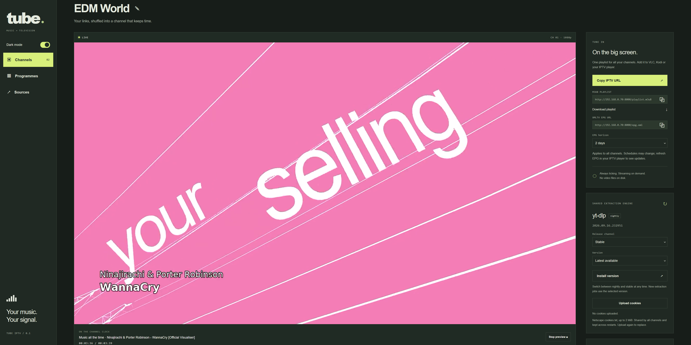

# Tube IPTV

<p align="center">
  
</p>

<p align="center"><strong>Your videos. Your channels. Your TV.</strong><br>
Turn videos and playlists into TV channels you can watch in your browser or IPTV player.<br>
<i>Made with Codex</i></p>

Tube IPTV lets you build your own channels from links supported by [yt-dlp](https://github.com/yt-dlp/yt-dlp). Add a few sources and let them play, or create a weekly schedule with programmes for different times of day.

Like a TV channel, everyone joins the programme already in progress. The schedule keeps moving even when nobody is watching.



## What you can do

- Create multiple channels, each with its own videos and playlists.
- Schedule weekly programmes using a drag-and-drop calendar.
- Watch in your browser, VLC, Kodi, or another IPTV player.
- Get a programme guide (EPG) for your channels.
- Add artist and song captions to music programmes.
- Choose video quality from 480p to 4K, with optional GPU encoding.

Videos are streamed without saving them to disk. Your channels, settings, and schedules are saved between restarts.

## Get started with Docker

You need Docker with Compose on a Linux x86-64 server or PC. Ready-made images are available from [GHCR](https://ghcr.io/d4rk-4lchemy/tube-iptv); see the [available versions](https://github.com/d4rk-4lchemy/tube-iptv/pkgs/container/tube-iptv).

Create a folder for Tube IPTV and save this as `compose.yaml` inside it:

```yaml
services:
  tube:
    image: ghcr.io/d4rk-4lchemy/tube-iptv:latest
    container_name: tube-iptv
    restart: unless-stopped
    ports:
      - "8000:8000"
    environment:
      TZ: Europe/Warsaw
    volumes:
      - tube-data:/data
    read_only: true
    tmpfs:
      - /tmp:size=64m,mode=1777
    security_opt:
      - no-new-privileges:true
    cap_drop:
      - ALL

volumes:
  tube-data:
```

Change `TZ` to your timezone, then run this from the same folder:

```bash
docker compose up -d
```

Open <http://localhost:8000>. If Docker runs on another machine, use that machine's IP address instead of `localhost`.

The `latest` image follows new releases. To stay on a particular version, replace `latest` with its release tag, such as `v0.1.0`.

### Prefer to build it yourself?

Clone this repository and start it using the included Compose file:

```bash
git clone https://github.com/d4rk-4lchemy/tube-iptv.git
cd tube-iptv
docker compose up -d --build
```

## Watch your first channel

1. Open the web console and select a channel, or choose **New channel**.
2. Add a video, playlist, or channel URL under **Sources** and wait for it to finish loading.
3. Click **Watch channel** to start the browser preview.

To watch on a TV or in another app, copy the playlist URL from the console's IPTV card into your player. It includes all your channels. The default address is `http://YOUR-SERVER-IP:8000/playlist.m3u8`.

Most players can discover the programme guide from the playlist. If yours needs a separate address, copy **XMLTV EPG URL** from the same card.

The first stream may take a moment to start. When nobody is watching, Tube IPTV stops processing video to save resources; returning viewers join the current point in the schedule.

## Plan your week

Without programmes, a channel plays its sources in shuffled rotation.

For a weekly schedule, open **Programmes → New programme**, give it a name, choose its duration and broadcast times, then add videos under **Programme sources**. Each programme has its own collection of videos, separate from the channel's general **Sources**.

Drag a programme in the calendar to change its weekly time, or use **Edit** for finer adjustments. The calendar uses the timezone you set in Docker. Changes repeat every week.

Use **Between programmes** to choose between a black screen and random videos from the channel's general sources. A programme with no playable sources shows a black screen with silence.

For a music programme, enable **Music** to show the artist and song title near the beginning and end of each clip.

## Settings you may want to change

Video quality, frame rate, and bitrate can be adjusted per channel in the console. Higher quality needs more processing power, especially when several channels are watched at once.

For server settings, add these values under `environment:` in your Compose file:

| Setting | When to use it |
| --- | --- |
| `TZ: Europe/Warsaw` | Set the timezone used by your weekly schedule. |
| `PUBLIC_URL: http://192.168.1.20:8000` | Make copied playlist links use your server's address. Replace this example with your own. |
| `ADMIN_PASSWORD: "your-password"` | Protect the web console. Sign in as `admin`. |
| `STREAM_TOKEN: "your-stream-token"` | Protect playback links separately from the console. Copied links include this token. |

After editing the file, run `docker compose up -d` to apply it.

The default setup is for a trusted home network. For access over the Internet, set a console password and stream token, and put the app behind an HTTPS reverse proxy.

### GPU encoding

Tube IPTV uses the CPU by default. The console's **GPU engine** panel lets you select an encoder and test it before saving. Your GPU must first be accessible inside the container.

For Intel or AMD on Linux, the repository includes [a GPU Compose configuration](compose.gpu.yaml). Find your device group IDs:

```bash
stat -c '%g' /dev/dri/renderD128 /dev/dri/card0
```

Set `RENDER_GID` and `VIDEO_GID` in a `.env` file to the respective values, then, from the cloned repository, run:

```bash
ENCODER=vaapi docker compose -f compose.yaml -f compose.gpu.yaml up -d --build
```

Intel Quick Sync is also available with `ENCODER=qsv`. NVIDIA NVENC needs additional host and container setup; it is not enabled by this Compose file.

## Updates and saved data

For the ready-made image:

```bash
docker compose pull
docker compose up -d
```

If you pinned a version, change the image tag first. If you build locally, pull the latest repository changes and run `docker compose up -d --build` instead.

Your channels, schedules, settings, and cookies are stored in the `tube-data` Docker volume. They survive container updates. Keep that volume and back it up before upgrading; removing it deletes your saved setup.

You can update **yt-dlp** separately from the web console, without rebuilding Tube IPTV. Try a newer stable or nightly release if a source stops working.

## If a source does not play

Check its status in the console and try **Refresh**. Source websites can change or restrict access by location, account, or IP address; updating yt-dlp may help with website changes.

For sources that need a login, use **yt-dlp → Upload cookies** with a Netscape-format `cookies.txt` file, then refresh the source. Cookies apply to all channels. Treat them like a password and use **Delete cookies** when you no longer need them.

Tube IPTV does not bypass DRM or service access restrictions, and it does not import local media libraries, Plex, or Jellyfin.

For more clues, view the container logs:

```bash
docker compose logs -f
```
